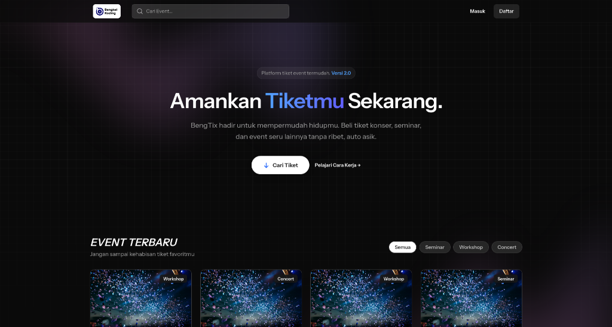

# Ticket WBK App



> **The Future of Event Ticketing.**  
> *Built for you Bengkel Koding <3.*

---

## 🚀 Features

-   **⚡ Real-time Updates**: Live ticket availability and event status.
-   **🎨 Modern UI**: Built with Laravel Livewire Starterkit and filament for rapid development.
-   **🔐 Secure**: Robust authentication and authorization.
-   **📱 Responsive**: Seamless experience across all devices. i hope you it will be fine.
-   **🛒 Easy Checkout**: just prototype. dont hope it will be fine.

## 🛠️ Tech Stack

`Laravel` `Livewire` `Filament` `TailwindCSS` `Alpine.js` `SQLite`

## 🏁 Quick Start

```bash
# 1. Clone & Setup
git clone https://github.com/akunnyaanam/ticket-wbk-app.git
cd ticket-wbk-app && cp .env.example .env

# 2. Install Dependencies
composer install && npm install

# 3. Ignite
php artisan key:generate
php artisan migrate --seed
npm run dev
php artisan serve
```

## 📜 License

MIT License. Built for you Bengkel Koding <3.
